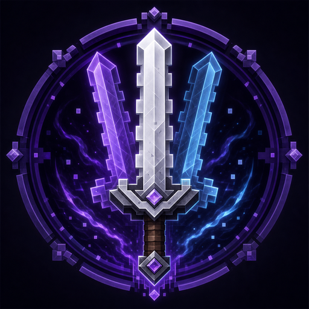

# Echo Relics



Echo Relics is a NeoForge mod for Minecraft Java Edition 26.2. The Echo Blade
records the position and horizontal direction of a melee slash and replays the
slash in that same space later. The Echo Sigil leaves a fixed echo of your past
self so one player can cooperate with an earlier position.

Echo Relics は Minecraft Java Edition 26.2 向けの NeoForge Mod です。最初の遺物
「残響の剣」は、近接斬撃の位置と水平向きを記録し、後から同じ空間で斬撃を
再生します。

## Requirements / 動作環境

- Minecraft Java Edition 26.2
- NeoForge 26.2.0.28-beta or a compatible later 26.2 build
- Java 25
- The mod must be installed on both the server and every connecting client.

## Getting the Echo Blade / 入手方法

- Craft an amethyst shard, an iron ingot, and a stick in one vertical column.
- Find it in the dedicated Echo Relics creative tab or the Combat tab.
- Use `/give @s echorelics:echo_blade`.

アメジストの欠片、鉄インゴット、棒を縦一列に並べてクラフトできます。専用の
Echo Relicsタブ、戦闘タブ、または `/give @s echorelics:echo_blade` でも取得できます。

The blade uses iron-sword tool properties: 250 durability, iron repair
materials, attack damage baseline 3, and attack speed modifier -2.4.

## Echo behavior / 残響の挙動

- A successful primary hit creates exactly one record. A fully charged swing
  into empty space also creates one record, allowing a slash to be placed
  before a target arrives. Cancelled attacks, invalid hits, and rapid
  undercharged empty swings create none.
- The record snapshots the player's dimension, feet position, horizontal
  direction, attack-cooldown-scaled damage, shape, replay count, and timing.
- After 60 ticks by default, the server searches the recorded slash volume
  again. It does not remember or follow the original target.
- The volume reaches 3.0 blocks forward, is 2.5 blocks wide, and spans from
  0.25 blocks below to 2.25 blocks above the recorded feet position.
- Every valid living entity whose bounding box intersects that volume is
  checked. The owner, allies, disabled PvP targets, friendly-fire-disabled
  teammates, invulnerable targets, and marker armor stands are respected.
- Echo damage does not replay critical hits, target-specific enchantment
  bonuses, fire, knockback, durability use, or normal weapon callbacks.

通常攻撃が成立した時点の空間を固定するため、元の対象が離れれば外れ、後から
別の対象が入ればその対象に命中します。プレイヤーが移動・振り向き・武器交換
をしても、待機中の記録は変化しません。

## Enchantments / エンチャント

| Enchantment | Level | Effect |
| --- | ---: | --- |
| Reverberation / 反響 | I–III | Total echoes: 2 / 3 / 4 |
| Accelerando / 加速 | I–III | Interval: 45 / 30 / 15 ticks |

Without Reverberation, one echo is produced. Without Accelerando, the interval
is 60 ticks. Both enchantments are available from the enchanting table and
anvil for the Echo Blade. Books for every level I–III are also listed in the
Echo Relics creative tab.

## Echo Sigil and archive devices / 残響印と遺跡装置

- Use the Echo Sigil to record your server-authoritative position and facing.
  A fixed echo appears there after 60 ticks, remains for 100 ticks, and the
  Sigil has a 160-tick cooldown.
- Only a living player or a fixed Echo Sigil avatar can hold an Echo Plate.
  Other mobs and ordinary projectiles do not activate it.
- A Resonance Target ignores direct attacks. A player-aligned spatial echo,
  such as an Echo Blade replay, activates it for 80 ticks.
- An Archive Door reads only its explicitly positioned inputs. It opens for
  one active Resonance Target two blocks above the space directly in front, or
  for two active Echo Plates placed three blocks in front and two blocks to
  either side.
- A vacated Echo Plate remains powered for a 40-tick crossing grace period.
  Grace can keep an already-open gate open, but cannot help open a closed gate:
  both plates must be actively held by the present player, another player, or
  a past avatar. An open Archive Door also defers closing while a living player
  occupies its passage.
- Echo avatars are temporary, non-colliding, do not activate vanilla pressure
  plates, and are removed when replaced or when their owner dies, logs out, or
  changes dimension.

Echo Sigilは使用地点と向きを記録し、60 tick後にその場へ100 tick残る固定残像を
出します。現在の自分と残像で二枚のEcho Plateを同時に踏めます。
Resonance Targetは通常攻撃ではなく、プレイヤー由来の残響斬撃だけに反応します。
Archive Doorは、正面の通路から2ブロック上にある標的、または正面3ブロック先から
左右へ2ブロックずつ離して置いた二枚のPlateだけを入力として読みます。Plate解除後
には40 tickの通過猶予がありますが、閉じた扉を開く瞬間は二枚とも誰かが踏んでいる
必要があります。プレイヤーが扉内にいる間は閉鎖しません。

## Grand Echo Archive / 大残響書庫

Grand Echo Archives generate as uncommon surface archives in plains,
sunflower plains, and savannas. Candidates whose nine terrain samples vary by
more than four blocks are rejected. For development or a contest demo, use:

```mcfunction
/locate structure echorelics:grand_echo_archive
```

The fixed contest layout is intended as a forward route. Dedicated-server
placement and passage collision are covered by automated tests; a complete
real-client walkthrough remains a manual check:

1. The paired entrance caches supply multiple Echo Blades.
2. Place an empty-space slash so its replay intersects the first Resonance
   Target; the first seal opens.
3. The next paired caches supply multiple Echo Sigils.
4. Leave an avatar on one Echo Plate and stand on the other.
5. In the guard hall, lure enemies through prepared slash spaces and activate
   the final target with a replay.
6. Cross the clock archive and fight the Archivist. Its successful melee slash
   is warned and replayed three seconds later in the same hostile space.
7. Below half health, place delayed player slashes through both arena
   Resonance Targets to break its otherwise invulnerable seal.
8. Defeat it to permanently open both reward gates, earn the challenge
   advancement, and obtain the Awakened Echo Blade.

大残響書庫は平原、ヒマワリ平原、サバンナのうち、9点の高低差が4ブロック以内の
地表候補へ自然生成されます。入口で剣を受け取り、空間斬撃、過去の自分との二枚
Plate、残響を利用した戦闘の順に学ぶ固定経路です。専用サーバー上の配置と通路衝突
は自動確認済みですが、実クライアントでの全区間通し攻略は未確認です。最終書庫の
Archivistは、自身の近接斬撃を固定空間へ敵性残響として再生します。体力が半分以下に
なると結界を展開するため、アリーナの二つのResonance Targetをプレイヤー由来の残響で
同時に起動して解除します。撃破すると前後の報酬扉が恒久的に開き、強化版の残響の剣と
専用進捗を得られます。

## The Archivist / 記録者

- 120 health, melee AI, home-bound arena movement, and a shared server boss bar.
- Every successful melee hit records the boss's position and horizontal slash
  direction. The replay searches that hostile volume again; it does not retain
  or follow the hit player.
- Hostile records use the common scheduler, shape, and target-policy pipeline
  but use red/orange warning effects and can target players only.
- At half health the boss becomes immune to ordinary damage until both fixed
  arena targets are active. Missing target blocks are restored while the seal
  is active so the fight remains retryable.
- The boss, shield state, arena home, and gate positions are saved with the
  entity. Its reward and exit gates keep a permanent unlocked block state after
  a real death.
- The Phase 3 player-echo copying mechanic is deliberately not part of P0; it
  remains the first P1 candidate after real-client and multiplayer validation.

Archivistの敵性残響も元の相手を追いません。攻撃成立時の位置と方向を記録し、予兆後に
その空間へ入ったプレイヤーだけを再検索します。残響コピーを行うPhase 3はP1候補であり、
P0ではPhase 1の敵性空間斬撃とPhase 2の残響封印を完成範囲としています。

## Server configuration / サーバー設定

NeoForge writes `echorelics-server.toml` under the server configuration
directory. It controls:

- base, minimum, and Accelerando timing;
- warning lead time;
- damage multiplier;
- slash reach, width, and vertical offsets;
- per-player and global pending-record caps;
- maximum replay executions per server tick;
- maximum living targets processed by one replay;
- maximum archive blocks inspected by one replay.

Values are snapshotted when an attack succeeds. Changing configuration does
not retroactively alter records that are already waiting.

## Lifecycle and known limitations / ライフサイクルと既知の制限

- Pending records are memory-only. Logout, death, dimension change, and server
  shutdown discard that player's records.
- Echoes do not force-load chunks. If the recorded chunk is unloaded at replay
  time, the replay is consumed without damage or visible effects.
- v0.1 does not test block occlusion, so an echo can hit through a wall inside
  its recorded volume.
- Vanilla hurt invulnerability remains in force. Closely spaced echoes or
  attacks from several players can therefore reduce later damage.
- Pending limits default to 64 per player, 4096 per server, and 128 replay
  executions per tick. New records are rejected when a pending limit is full.
- Archivist gate unlocking never force-loads chunks. Both gates are within its
  arena and normally loaded during the fight; externally moving or killing the
  boss while those gate chunks are unloaded can leave them closed.
- The Archivist currently uses a tinted vanilla player model, vanilla particles,
  and vanilla sounds as contest-safe provisional visuals.
- The item texture and project logo are provisional v0.1 artwork.

## Building and testing / ビルドとテスト

```powershell
.\gradlew.bat build
.\gradlew.bat runGameTestServer
.\gradlew.bat runServer
.\gradlew.bat runClient
```

`runGameTestServer` covers rotated-volume boundaries, fixed-space re-querying,
multi-target hits, repeated replay safety, no-knockback damage, scheduling order
and limits, cooldown damage scaling, enchantment-table tags, enchanted books,
creative-tab contents, Sigil scheduling/cooldown, fixed-avatar constraints, and
both target-gated and two-plate doors. It also checks absolute avatar expiry,
device placement/removal updates, refreshed target timing, Archive dynamic
registry decoding, and an actual server-side `/place structure` generation.
Archivist coverage includes hostile fixed-space retargeting, the two-target
shield, post-shield damage, permanent gate unlocking, entity loot, the
Awakened Echo Blade's shared capture behavior, and advancement data loading.
The boss test uses a server-listed player damage source and verifies that the
dedicated advancement is actually completed.
Multiplayer PvP/team behavior and client visuals still require the manual
smoke checks described in `docs/TESTING.md`.

The built mod is `build/libs/echorelics-0.1.0.jar`.

## License

Echo Relics is All Rights Reserved. See `LICENSE`. The original NeoForge MDK
template notice is retained in `TEMPLATE_LICENSE.txt`.
